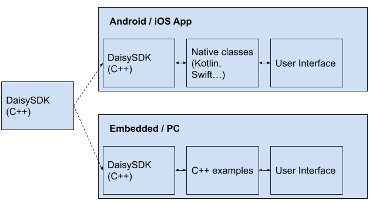

DaisyKit SDK is the core of models and algorithms, which can be used to develop wrappers and applications for different platforms: mobile, embedded or web browsers.

**Github:** <https://github.com/VNOpenAI/daisykit>.



## I. Environment Setup

- Install OpenCV. In Ubuntu:

```
sudo apt install libopencv-dev
```

- Install Vulkan dev. In Ubuntu:

```
sudo apt-get install -y libvulkan-dev
```

- Download [precompiled NCNN](https://github.com/Tencent/ncnn/releases), extract it (version for your development computer).

- Download all assets [here](https://drive.google.com/drive/folders/1ZAM8W4hHkV7-zmfHFjIGLAuso3QajUfW?usp=sharing) and put into `assets/` folder.

## II. Build and Run on PC

```
mkdir build
cd build
cmake .. -Dncnn_FIND_PATH="<path to ncnn lib>"
make
```

- Run Pushups example

```
./demo_pushup_full
```